# HR Color Predictor

> Horse Reality color predictor ☆ a Chrome extension by **claymore**
>
> 🌐 **English** · [Español](README.es.md)

HR Color Predictor is a Chrome extension for the browser game [Horse Reality](https://v2.horsereality.com). It reads the genotype data already shown on a horse's profile page, lets you pick a dam and a sire, and instantly calculates every possible color outcome for their offspring (genotype, phenotype, color name, and probability) for any pair of same-breed horses.

No more cross-referencing the wiki, hand-rolling Punnett squares, or keeping spreadsheets. Everything runs locally in your browser.

---

## How it works

On every horse's profile page, two new buttons appear in the top-right corner.

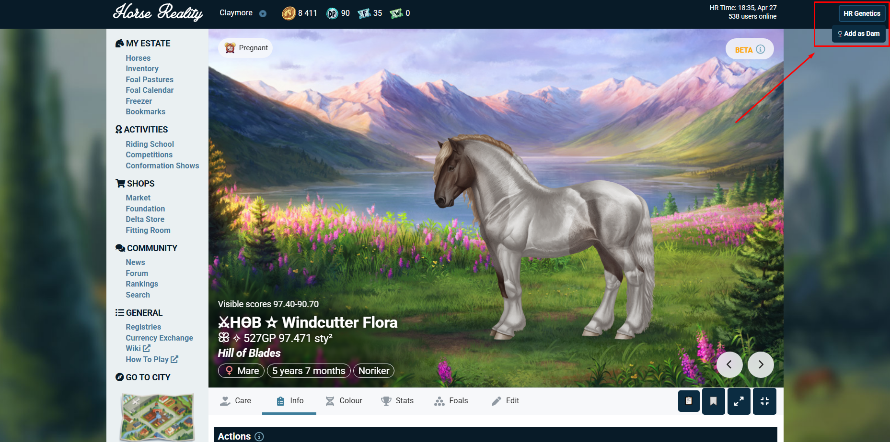

Clicking **HR Color Predictor** opens the sidebar with your saved pairings.

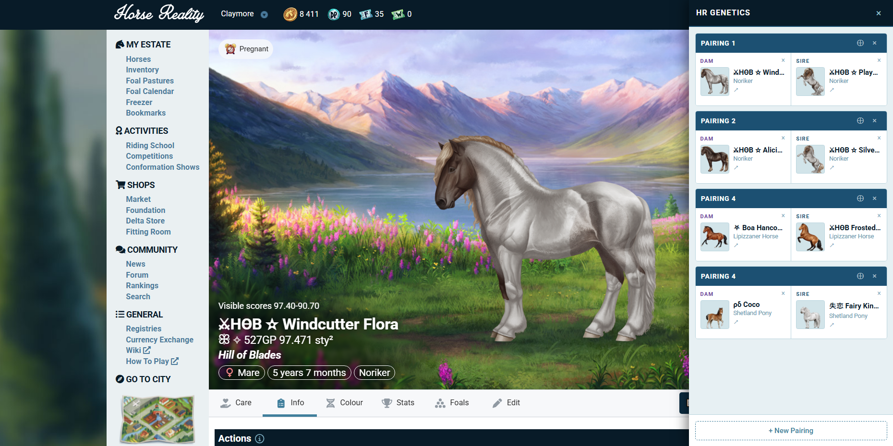
---

## Making a pairing

**Rules for a valid pairing:**

- Both horses must be the **same breed**.
- One slot must be a **dam**, the other a **sire**.
- Each horse needs **at least one tested gene**. Partially tested horses produce partial results, and the pairing card will flag them as such.

Age, retirement status, or whether a horse is deceased doesn't matter. You can also pair colts and fillies to predict their future offspring.

### Walkthrough

To start a pairing, click **Add as Dam** or **Add as Sire** on the horse's profile page.

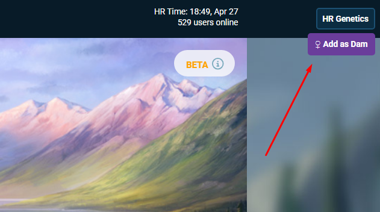

Then click **+ Create new pairing**. (If you already have a pairing with a free slot of the matching gender, you'll also be offered the option to add the horse there.)

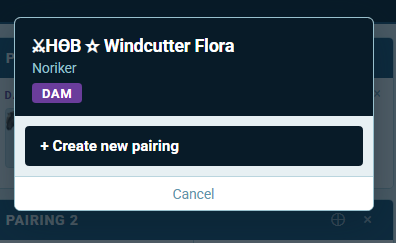
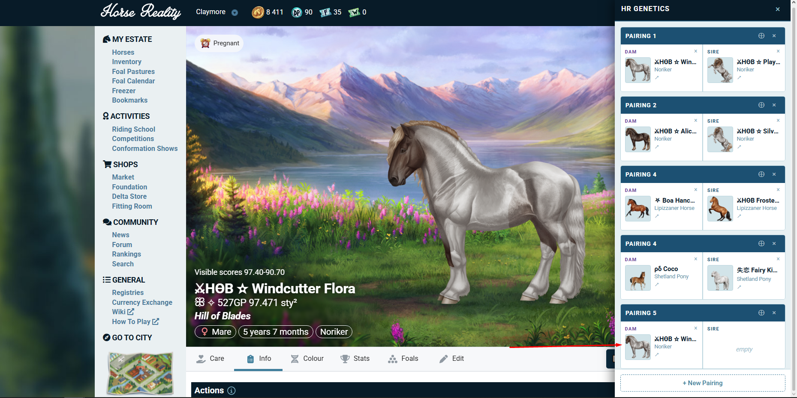

Now that the dam is in a pairing, find her a sire. Go to the stallion's profile and click **Add as Sire**.

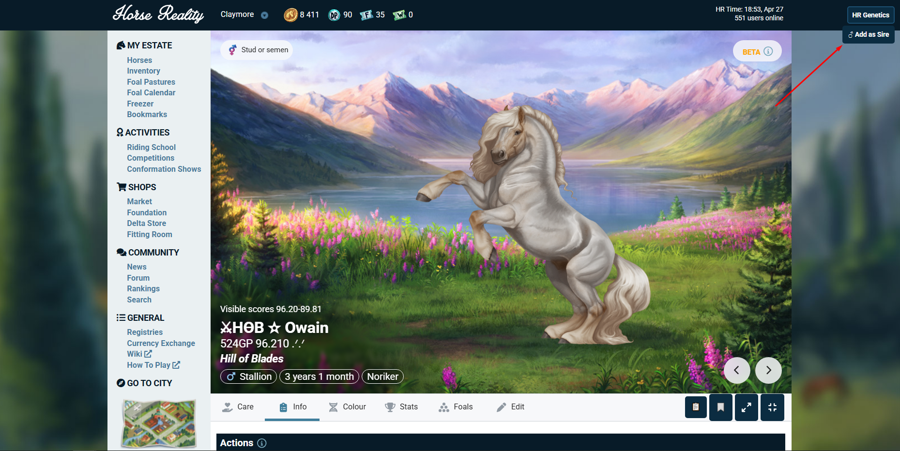

You'll get the option to add him to the pairing you just created.

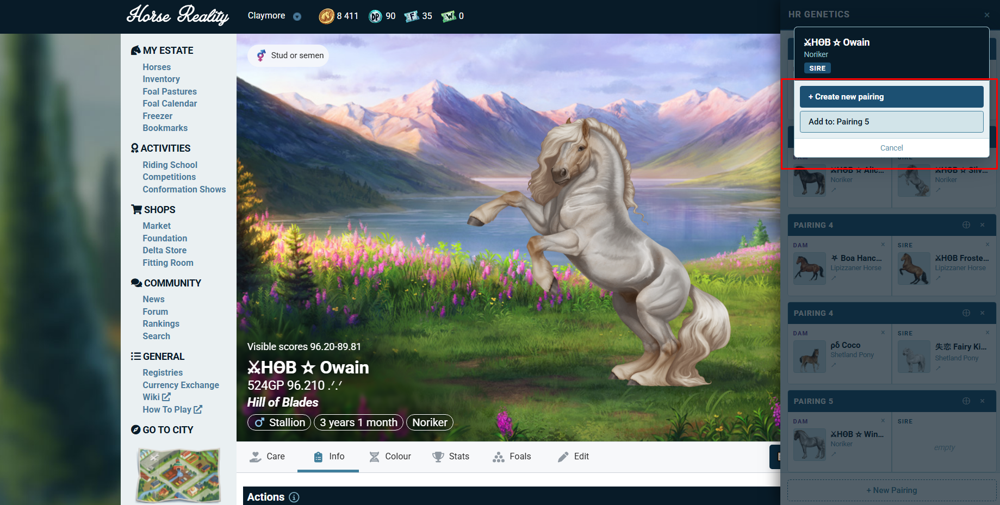

The **+ New Pairing** button creates an empty pairing you can fill in later.

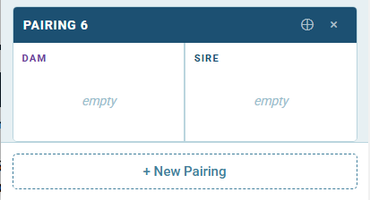
---

## Seeing prediction results

Click any complete pairing to open the results view. You'll see a table with one row per possible offspring outcome, showing:

- **Genotype**: the exact allele combination (`E: E/e · A: A/a · CR: CR/n …`)
- **Phenotype**: the color name and any white-pattern overlays (e.g. *Buckskin Dun · Tobiano*)
- **Probability**: the chance of that outcome, in %

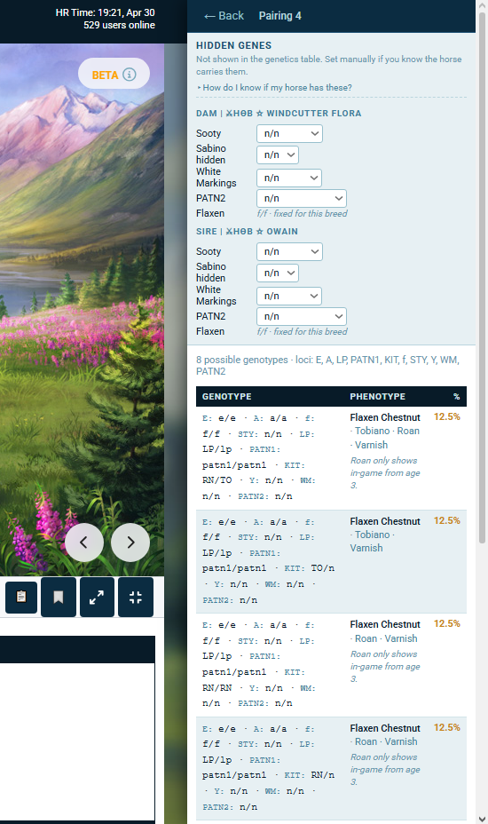

Lethal combinations (OLW/OLW, homozygous Wx except W20/W20) are flagged on their own row.

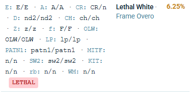

---

## Manually selecting hidden genes

Horse Reality's test panel doesn't show every gene. Some are present in the breed but untestable in-game: A+ and At within the Agouti slot, Hidden Sabino (Y), etc. The predictor pulls everything it can from the test panel, the rest you can declare manually if you know the horse carries them.

Click **How do I know if my horse has these?** for guidance.

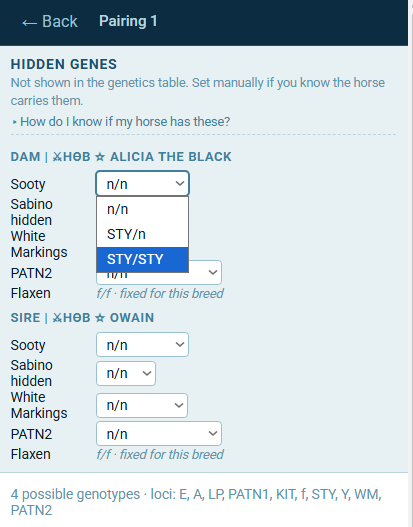 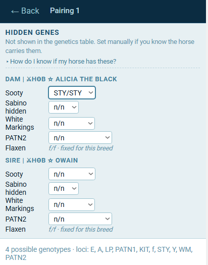

Toggling a hidden gene updates the predicted outcomes immediately. **If you're not sure, leave it as default.**

---

## Renaming, copying, and deleting a pairing

You can rename, duplicate, and delete pairings from the pairing card. The arrow on each horse lets you add that dam or sire to another pairing, or start a new one, without revisiting their profile page. Hidden gene selections carry over, so you don't have to set them again.

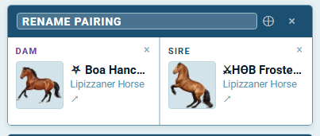 

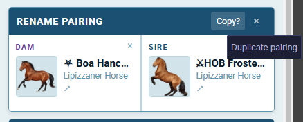

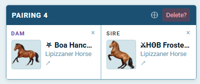

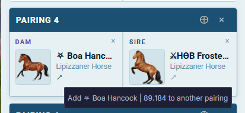


---

## How to install

HR Color Predictor isn't on the Chrome Web Store yet, so you'll load it as an unpacked extension. One-time setup:

1. Download the latest release `.zip` from the [releases page](https://github.com/g1nebra/horse-reality-color-predictor/releases/latest) and unzip it, or clone this repo.
2. In Chrome, go to `chrome://extensions/`.
3. Toggle **Developer mode** on (top-right).
4. Click **Load unpacked** and select the `hr-color-predictor/` folder.
5. Pin the extension from the puzzle-piece menu so the icon stays visible.

Open any horse's profile on horsereality.com and you should see the two new buttons.

**Updating:** download the new version, replace the folder contents, and click the refresh icon on the extension's card in `chrome://extensions/`.

---

## Safety and fair play

**Everything happens locally.** HR Color Predictor has no server, no account, and no telemetry. Your pairings are stored in your browser's local extension storage. Removing the extension deletes all saved pairings. There's no cloud copy, your data never leaves your computer.

**It's not a cheat or an automation tool.** The extension only reads information that's already visible on the horse's page and helps you interpret it. It doesn't interact with the game, or expose anything that wasn't already shown to you.

This falls under the kind of tool described in Horse Reality's [Rule 7: Writing Scripts](https://v2.horsereality.com/rules#7), which permits *"Programs that scrape publicly available Horse Reality data to an external spreadsheet or database, or that only modify the user interface."* I reached out to the HR team before publishing and they confirmed the extension is okay under that rule.

This doesn't mean the extension has official support from Horse Reality. Per the same rule, third-party programs are the exclusive responsibility of those who develop them. Horse Reality is not responsible for the maintenance, integrity, or continuation of this extension. Any bugs or feature requests should be sent directly to me, not to HR support.

---

## Reporting a bug

HR Color Predictor is built and maintained by one person as a side project. Each breed and HR-specific mechanic is mapped manually, so bugs and edge cases will happen.

If you spot a bug, an outdated mapping, a wrong color name, or anything visually off, please let me know. **Helpful info to include:**

- Breed and the genotype of both horses (or the profile URLs)
- What you expected vs. what you saw
- Screenshot of the results panel and the horse's test panel
- Extension version (visible in `chrome://extensions/`)

You can find me on Horse Reality as **claymore**, or open an issue on this repo. I'll get to it as fast as I can.

---

## More documentation

For deeper detail on how everything is designed and works:

- [`planning-and-research/hr_genetics_reference_claymore_v1.html`](planning-and-research/hr_genetics_reference_claymore_v1.html): full copy of the genetics data from Horse Reality's Notion, used as the source of truth for breed mappings.
- [`planning-and-research/planning.md`](planning-and-research/planning.md): project planning document. Scope, architecture, data layer, development phases.
- [`planning-and-research/phenotype_resolver_plan.md`](planning-and-research/phenotype_resolver_plan.md): rules and override hierarchy used to translate genotypes into color names.

If you find anything in the documentation that's incorrect, outdated, or unclear, let me know.

---

## License

[GPL-3.0](LICENSE). HR Color Predictor is free and open-source software. You can use, modify, and redistribute it, but any version you distribute must also be open source under GPL-3.0.

---

Thanks for trying HR Color Predictor! I hope it saves you some Punnett-square headaches and helps you breed exactly the horse you're after. If you've got feedback, ideas, or just want to share a really good foal you got, you know where to find me.

### Happy horsing ! !

```text
        /\/\
       /    \
     ~/(^  ^)
    ~/  )  (
   ~/   (  )
  ~/     ~~
 ~/      |_
```

